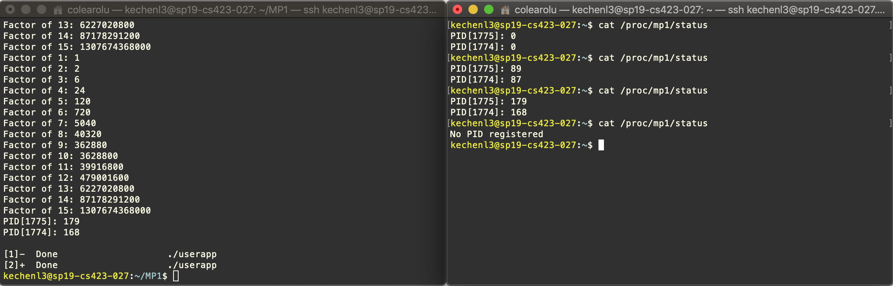

# CS423 MP1

# Introduce

This the README document of the CS423 MP1, writen by Kechen Lu (kechenl3), is for introducing How-to and the basic implementation ideas of this machine problem.

This module is compiled in the Linux Kernel v4.4 which is running over the VM the MP0 has done that. Basically, this module runs for mataining a linked list to get the running processes registered, and during the running process, it could read from the proc file to get all registered processes and its corresponding CPU used time. This module used the proc/ filesystem, the kernel timer and the work queue architecture.

# How-to

## How-to Compile

```bash
$ make all
```

Running make all to compile the user app and kernel modules.

## How-to Install

```bash
$ sudo insmod kechenl3_MP1.ko
```

After installing the module, we will see the log through dmesg, implying the module has been loaded. 

```bash
$ dmesg
[ 1616.056476] MP1 MODULE LOADING
[ 1616.056545] MP1 MODULE LOADED
```

## How-to Run

We can use the user app to test the customerized proc file working correctly. By running the cmd below to concurrentlly run the two processes.

```bash
$ ./userapp&./userapp&
...
Factor of 1: 1
Factor of 2: 2
Factor of 3: 6
Factor of 4: 24
Factor of 5: 120
Factor of 6: 720
Factor of 7: 5040
Factor of 8: 40320
Factor of 9: 362880
Factor of 10: 3628800
Factor of 11: 39916800
Factor of 12: 479001600
Factor of 13: 6227020800
Factor of 14: 87178291200
Factor of 15: 1307674368000
PID[5670]: 197
PID[5669]: 195

[1]-  Done                    ./userapp
[2]+  Done                    ./userapp
```

While running the two processes, the current registered process cpu used time could be read by cat the /proc/mp1/status. After the two processes running done, the registered prcocess would be removed from the list.

```bash
kechenl3@sp19-cs423-027:~$ cat /proc/mp1/status 
PID[1764]: 27
PID[1763]: 47
PID[1762]: 27
kechenl3@sp19-cs423-027:~$ cat /proc/mp1/status 
PID[1764]: 27
PID[1763]: 47
PID[1762]: 27
kechenl3@sp19-cs423-027:~$ cat /proc/mp1/status 
PID[1764]: 83
PID[1763]: 100
PID[1762]: 65
kechenl3@sp19-cs423-027:~$ cat /proc/mp1/status 
PID[1764]: 194
PID[1763]: 198
PID[1762]: 183
kechenl3@sp19-cs423-027:~$ cat /proc/mp1/status 
No PID registered
```

## How-to Remove

```bash
$ sudo rmmod kechenl3_MP1
$ dmesg
[ 1604.079952] MP1 MODULE UNLOADING
[ 1604.080006] MP1 MODULE UNLOADED
```

# Screenshot when two user apps are running



